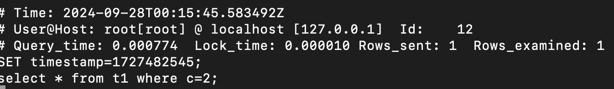
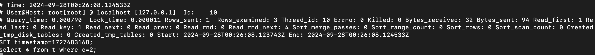

# 2. `log_slow_extra`

## 2.1 参数含义

- `log_slow_extra`: 用于控制慢查询日志中是否记录更多诊断信息(MySQL8.0新添加的参数)

```
vim /etc/mysql/mysql.conf.d/mysqld.cnf
```

在`[mysqld]`模块下添加一行:

```
# 在慢查询日志中记录更多诊断信息
log_slow_extra = ON
```

重启服务:

```
root@mysql-master:~# systemctl restart mysql.service
```

进入MySQL查看配置项:

```
mysql> show variables like 'log_slow_extra';
+----------------+-------+
| Variable_name  | Value |
+----------------+-------+
| log_slow_extra | ON    |
+----------------+-------+
1 row in set (0.00 sec)
```





- 多了排序/临时表等相关信息
- 损失: 额外多了一点点的内存和CPU的消耗
- 但从诊断意义来讲,值得开