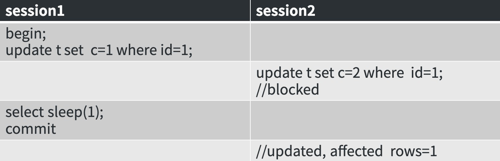

# 3. 课堂练习--5.7和8.0关于慢查询日志差异



- 现有2个SESSION:
- SESION1执行:

	```
	BEGIN;
	UPDATE SET `t` `c` = 1 WHERE `id` = 1; 
	```
	
	注意此时并没有提交这个事务
	
- 然后SESSION2执行:

	```
	UPDATE `t` SET `c` = 2 WHERE `id` = 1;
	```
	
	当然,此时SESSION2的这条语句会被阻塞
	
- 然后SESSION1执行:

	```
	SELECT sleep(1);
	COMMIT;
	```
	
	此时行锁释放,SESSION2的`UPDATE`语句将更新成功

- SESSION2得到执行结果:

	```
	updated,affected rows=1
	```
	
- 问: SESSION2的语句更新成功后,会不会记录到慢查询日志?
- 答: 在5.7中不会;在8.0中会
- 原因: **5.7中,将行锁的等待时间扣除掉了,仅计算了语句执行的时间;而8.0则没有扣除等待锁的时间**
	- 换言之,8.0中计算慢查询的方式为:(语句执行结束时间 - 语句执行开始时间),超过`long_query_time`则记录慢查询日志)
	- 这样其实是更合理的,因为这种被锁了导致查询变慢的情况是应该被诊断的