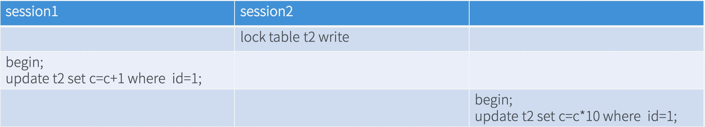
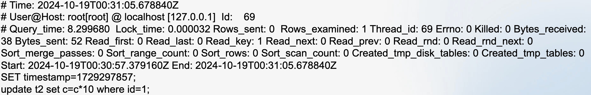
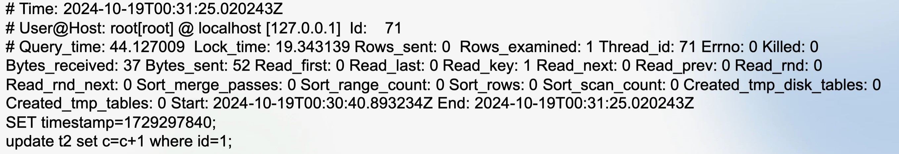

# 4. 课堂练习--MySQL8.0样例分析



- 注: 最右侧一列表头为`session3`,图片里没写,漏了

- 现有3个SESSION:
- SESSION2执行:

	```
	LOCK TABLE `t2` WRITE;
	```
	
	给表加了个表锁

- SESSION1开启事务:

	```
	BEGIN;
	UPDATE `t2` SET `c` = `c` + 1 WHERE `id` = 1;
	```
	
	当然,这条语句会被阻塞,因为此时表锁没有释放
	
- SESSION3开启事务:

	```
	BEGIN;
	UPDATE `t2` SET `c` = `c` * 10 WHERE `id` = 1;
	```

	这条语句也会被阻塞
	
- 当SESSION2的表锁释放时(假定表锁持续时间超过了`long_query_time`),SESSION1和SESSION3这两个事务的执行顺序是不确定的(看谁先拿到行锁)
- 问: 慢查询日志中,关于这两个事务的记录,是否会记录等待表锁的时间?
	- 在刚才的例子中我们很明确的知道慢查询日志会记录行锁的等待时间,这里的重点是是否会记录表锁的等待时间

- 分析: 假设是SESSION3先拿到行锁,其慢查询日志如下:



从慢查询日志中很明显的看出:

- `Query_time`: SQL的执行时间是8s多
- `Lock_time`: 但SQL加锁的时间是0.000032s(几乎可以忽略不计的),因此可以得出结论:
- 答: **慢查询日志的`Lock_time`没有计算等待表锁释放的时长,只计算了等待行锁释放的时长**

- 问: SESSION1的慢查询日志中,`Lock_time`记录的是什么时长?



- 答: 记录的是等待SESSION3释放行锁的时长 + 语句本身持有行锁的时长
- 注: 慢查询日志中的`Rows_examined`: 表示MySQL在执行该SQL语句期间,扫描/检查过的行数总数
- 注: 这个例子说明,**`Query_time - Lock_time`的时长不一定是SQL语句执行的时长,还有可能包含了等待表锁的时长**
- 注: 慢查询日志最大的问题在于: **所有写入慢查询日志的线程,是共用一把大锁的**