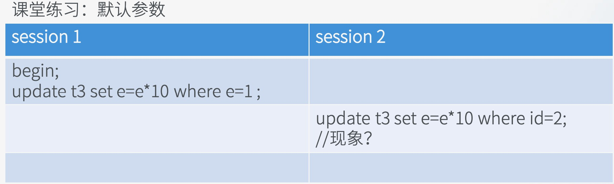
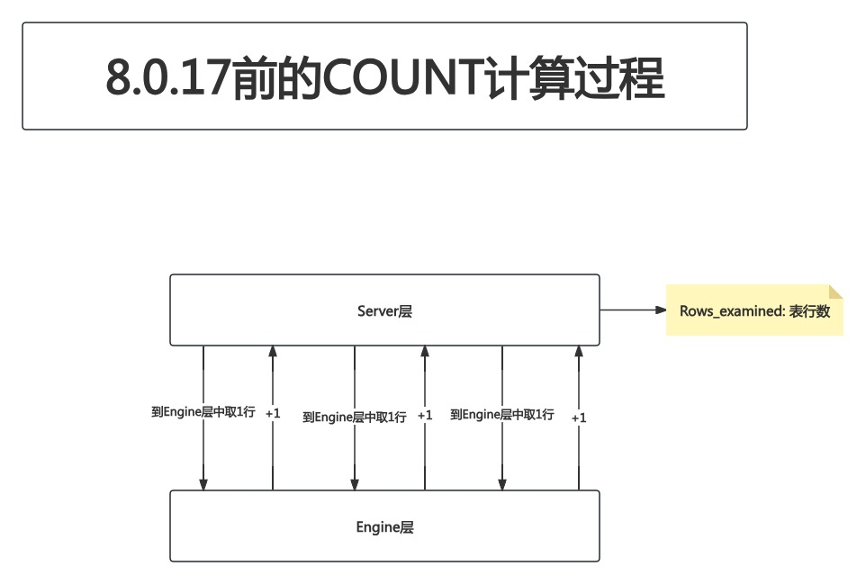
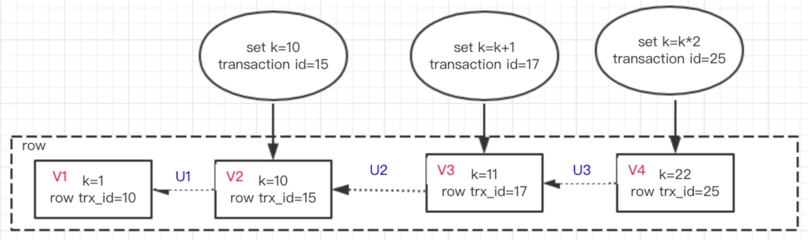

# 5. `log_queries_not_using_indexes`

## 5.1 参数含义

- `log_queries_not_using_indexes`: 控制是否将未使用索引的SQL查询(这里虽然说是查询,但`UPDATE`/`DELETE`等语句也一样)记录到慢查询日志

## 5.2 课堂练习--`UPDATE`语句针对未加索引的列锁的行数

- 现有一张表如下:

```SQL
CREATE TABLE `t3` (
  `id` int NOT NULL,
  `c` int DEFAULT NULL,
  `d` int DEFAULT NULL,
  `e` int DEFAULT NULL,
  PRIMARY KEY (`id`),
  KEY `c` (`c`),
  KEY `d` (`d`)
) ENGINE=InnoDB DEFAULT CHARSET=utf8mb4 COLLATE=utf8mb4_0900_ai_ci;
```

其中有3条数据:

```
mysql> select * from `t3`;
+----+------+------+------+
| id | c    | d    | e    |
+----+------+------+------+
|  1 |  833 |   10 |    1 |
|  2 |    2 |    2 |    2 |
|  3 |    3 |    3 |    3 |
+----+------+------+------+
3 rows in set (0.00 sec)
```

现在执行了一条`UPDATE`语句如下:

```SQL
UPDATE `t3` SET `e` = `e` * 10 WHERE `e` = 2;
```

- 问: 这条语句锁多少行?
- 答: 3行.
- 原因: **没有用到索引的`UPDATE`语句,会做全表扫描(`table scan`),即使最终只有1行需要被更新**.这种现象被称为`Next-Key Lock`
	- 换言之: **没有用到索引的`UPDATE`/`DELETE`语句,会逐行加锁(排他锁),直到语句结束**
	- 这样做的原因: 防止其他事务插入/修改影响结果

## 5.3 课堂练习--不加索引的`UPDATE`语句导致的阻塞



- SESSION1执行:

```SQL
BEGIN;
UPDATE `t3` SET `e` = `e` * 10 WHERE `e` = 1;
```
	
- SESSION2对`t3`表中的`id = 2`的数据执行`UPDATE`语句:

```SQL
UPDATE `t3` SET `e` = `e` * 10 WHERE `id` = 2;
```

- 问: SESSION2的`UPDATE`语句会不会被阻塞?
- 答: 直到SESSION1执行`COMMIT`或`ROLLBACK`之前,SESSION2都将被阻塞
- 此时查看慢查询日志:

```
# Time: 2025-07-14T14:25:34.569159Z
# User@Host: root[root] @  [192.168.1.151]  Id:    11
# Query_time: 7.165646  Lock_time: 7.158787 Rows_sent: 0  Rows_examined: 1 Thread_id: 11 Errno: 0 Killed: 0 Bytes_received: 59 Bytes_sent: 59 Read_first: 0 Read_last: 0 Read_key: 1 Read_next: 0 Read_prev: 0 Read_rnd: 0 Read_rnd_next: 0 Sort_merge_passes: 0 Sort_range_count: 0 Sort_rows: 0 Sort_scan_count: 0 Created_tmp_disk_tables: 0 Created_tmp_tables: 0 Start: 2025-07-14T14:25:27.403513Z End: 2025-07-14T14:25:34.569159Z
SET timestamp=1752503127;
UPDATE `t3` SET `e` = `e` * 10 WHERE `id` = 2;
```

- 通过这个实验,我们得出结论:`log_queries_not_using_indexes`这个参数应该开启

```
vim /etc/mysql/mysql.conf.d/mysqld.cnf
```

在`[mysqld]`模块下添加一行:

```
# 将没有使用索引的SQL记录到慢查询日志中
log-queries-not-using-indexes=ON
```

重启服务:

```
root@mysql-master:~# systemctl restart mysql.service
```

进入MySQL查看配置项:

```
mysql> show variables like 'log_queries_not_using_indexes';
+-------------------------------+-------+
| Variable_name                 | Value |
+-------------------------------+-------+
| log_queries_not_using_indexes | ON    |
+-------------------------------+-------+
1 row in set (0.01 sec)
```

TODO: 这里有2个问题需要查:(25min)左右

- 事务隔离级别
- 两阶段提交

## 5.4 `log_queries_not_using_indexes`导致慢查询日志过多

### 5.4.1 监控相关的查询

```
mysql> SELECT * FROM information_schema.processlist;
+----+-----------------+---------------------+-----------------------+---------+-------+------------------------+----------------------------------------------+
| ID | USER            | HOST                | DB                    | COMMAND | TIME  | STATE                  | INFO                                         |
+----+-----------------+---------------------+-----------------------+---------+-------+------------------------+----------------------------------------------+
|  8 | root            | 192.168.1.151:63019 | mysql_advanced_course | Sleep   |    16 |                        | NULL                                         |
|  9 | root            | 192.168.1.151:63020 | NULL                  | Sleep   |     3 |                        | NULL                                         |
| 12 | root            | localhost           | NULL                  | Query   |     0 | executing              | SELECT * FROM information_schema.processlist |
|  5 | event_scheduler | localhost           | NULL                  | Daemon  | 15342 | Waiting on empty queue | NULL                                         |
+----+-----------------+---------------------+-----------------------+---------+-------+------------------------+----------------------------------------------+
4 rows in set, 1 warning (0.00 sec)
```

- `SELECT * FROM information_schema.processlist`:列出当前MySQL Server端所有活跃线程的详细信息

```
mysql> SELECT * FROM information_schema.innodb_trx;
+--------+-----------+---------------------+-----------------------+------------------+------------+---------------------+-----------+---------------------+-------------------+-------------------+------------------+-----------------------+-----------------+-------------------+-------------------------+---------------------+-------------------+------------------------+----------------------------+---------------------------+---------------------------+------------------+----------------------------+---------------------+
| trx_id | trx_state | trx_started         | trx_requested_lock_id | trx_wait_started | trx_weight | trx_mysql_thread_id | trx_query | trx_operation_state | trx_tables_in_use | trx_tables_locked | trx_lock_structs | trx_lock_memory_bytes | trx_rows_locked | trx_rows_modified | trx_concurrency_tickets | trx_isolation_level | trx_unique_checks | trx_foreign_key_checks | trx_last_foreign_key_error | trx_adaptive_hash_latched | trx_adaptive_hash_timeout | trx_is_read_only | trx_autocommit_non_locking | trx_schedule_weight |
+--------+-----------+---------------------+-----------------------+------------------+------------+---------------------+-----------+---------------------+-------------------+-------------------+------------------+-----------------------+-----------------+-------------------+-------------------------+---------------------+-------------------+------------------------+----------------------------+---------------------------+---------------------------+------------------+----------------------------+---------------------+
|   5391 | RUNNING   | 2025-07-15 07:48:58 | NULL                  | NULL             |          2 |                   8 | NULL      | NULL                |                 0 |                 1 |                2 |                  1128 |               4 |                 0 |                       0 | REPEATABLE READ     |                 1 |                      1 | NULL                       |                         0 |                         0 |                0 |                          0 |                NULL |
+--------+-----------+---------------------+-----------------------+------------------+------------+---------------------+-----------+---------------------+-------------------+-------------------+------------------+-----------------------+-----------------+-------------------+-------------------------+---------------------+-------------------+------------------------+----------------------------+---------------------------+---------------------------+------------------+----------------------------+---------------------+
1 row in set (0.00 sec)
```

- `SELECT * FROM information_schema.innodb_trx`: 列出当前正在InnoDB存储引擎中活跃的所有事务的详细信息

```
SHOW ENGINE innodb STATUS\G;
```

- `SHOW ENGINE innodb STATUS`: 显示当前InnoDB存储引擎的详细运行状态信息

- 以上3条语句通常在服务器出现问题(如CPU打满)时,先上去把这3条语句打了

但是,这两张表都是没有索引的:

```
mysql> SHOW CREATE TABLE information_schema.processlist\G;
*************************** 1. row ***************************
       Table: PROCESSLIST
Create Table: CREATE TEMPORARY TABLE `PROCESSLIST` (
  `ID` bigint unsigned NOT NULL DEFAULT '0',
  `USER` varchar(32) NOT NULL DEFAULT '',
  `HOST` varchar(261) NOT NULL DEFAULT '',
  `DB` varchar(64) DEFAULT NULL,
  `COMMAND` varchar(16) NOT NULL DEFAULT '',
  `TIME` int NOT NULL DEFAULT '0',
  `STATE` varchar(64) DEFAULT NULL,
  `INFO` longtext
) ENGINE=InnoDB DEFAULT CHARSET=utf8mb3
1 row in set (0.00 sec)
```

```
mysql> SHOW CREATE TABLE information_schema.innodb_trx\G;
*************************** 1. row ***************************
       Table: INNODB_TRX
Create Table: CREATE TEMPORARY TABLE `INNODB_TRX` (
  `trx_id` bigint unsigned NOT NULL DEFAULT '0',
  `trx_state` varchar(13) NOT NULL DEFAULT '',
  `trx_started` datetime NOT NULL DEFAULT '0000-00-00 00:00:00',
  `trx_requested_lock_id` varchar(126) DEFAULT NULL,
  `trx_wait_started` datetime DEFAULT NULL,
  `trx_weight` bigint unsigned NOT NULL DEFAULT '0',
  `trx_mysql_thread_id` bigint unsigned NOT NULL DEFAULT '0',
  `trx_query` varchar(1024) DEFAULT NULL,
  `trx_operation_state` varchar(64) DEFAULT NULL,
  `trx_tables_in_use` bigint unsigned NOT NULL DEFAULT '0',
  `trx_tables_locked` bigint unsigned NOT NULL DEFAULT '0',
  `trx_lock_structs` bigint unsigned NOT NULL DEFAULT '0',
  `trx_lock_memory_bytes` bigint unsigned NOT NULL DEFAULT '0',
  `trx_rows_locked` bigint unsigned NOT NULL DEFAULT '0',
  `trx_rows_modified` bigint unsigned NOT NULL DEFAULT '0',
  `trx_concurrency_tickets` bigint unsigned NOT NULL DEFAULT '0',
  `trx_isolation_level` varchar(16) NOT NULL DEFAULT '',
  `trx_unique_checks` int NOT NULL DEFAULT '0',
  `trx_foreign_key_checks` int NOT NULL DEFAULT '0',
  `trx_last_foreign_key_error` varchar(256) DEFAULT NULL,
  `trx_adaptive_hash_latched` int NOT NULL DEFAULT '0',
  `trx_adaptive_hash_timeout` bigint unsigned NOT NULL DEFAULT '0',
  `trx_is_read_only` int NOT NULL DEFAULT '0',
  `trx_autocommit_non_locking` int NOT NULL DEFAULT '0',
  `trx_schedule_weight` bigint unsigned DEFAULT NULL
) ENGINE=MEMORY DEFAULT CHARSET=utf8mb3
1 row in set (0.00 sec)
```

- 问题: **如果打开`log_queries_not_using_indexes`这个参数,那么监控会导致慢查询日志的暴增,而且这种查询并不是我们需要关注的**

```
# Time: 2025-07-15T07:44:49.616173Z
# User@Host: root[root] @ localhost []  Id:    12
# Query_time: 0.001368  Lock_time: 0.000001 Rows_sent: 4  Rows_examined: 4 Thread_id: 12 Errno: 0 Killed: 0 Bytes_received: 51 Bytes_sent: 870 Read_first: 1 Read_last: 0 Read_key: 1 Read_next: 0 Read_prev: 0 Read_rnd: 0 Read_rnd_next: 5 Sort_merge_passes: 0 Sort_range_count: 0 Sort_rows: 0 Sort_scan_count: 0 Created_tmp_disk_tables: 1 Created_tmp_tables: 1 Start: 2025-07-15T07:44:49.614805Z End: 2025-07-15T07:44:49.616173Z
SET timestamp=1752565489;
SELECT * FROM information_schema.processlist;
```

```
# Time: 2025-07-15T07:49:02.088156Z
# User@Host: root[root] @ localhost []  Id:    12
# Query_time: 0.000749  Lock_time: 0.000001 Rows_sent: 1  Rows_examined: 1 Thread_id: 12 Errno: 0 Killed: 0 Bytes_received: 50 Bytes_sent: 2590 Read_first: 0 Read_last: 0 Read_key: 0 Read_next: 0 Read_prev: 0 Read_rnd: 0 Read_rnd_next: 2 Sort_merge_passes: 0 Sort_range_count: 0 Sort_rows: 0 Sort_scan_count: 0 Created_tmp_disk_tables: 0 Created_tmp_tables: 1 Start: 2025-07-15T07:49:02.087407Z End: 2025-07-15T07:49:02.088156Z
SET timestamp=1752565742;
SELECT * FROM information_schema.innodb_trx;
```

### 5.4.2 解决办法: `log_queries_not_using_indexes` + `log_throttle_queries_not_using_indexes`

- `log_throttle_queries_not_using_indexes`: 限制每分钟最多记录多少条未使用索引的慢查询到慢查询日志中,超过这个阈值后,则这些查询就不会再被记录到慢查询日志中,直到下一个时间窗口
- 效果: 并不好,不建议.因为有可能该记的慢查询没记,不用记的反而记了一大堆

### 5.4.3 解决办法: `log_queries_not_using_indexes` + `min_examined_row_limit`

- `min_examined_row_limit`: 用于设置一个阈值,只有当SQL查询"检查的行数"(即扫描/读取/过滤过的行数,也就是慢查询日志中的`Rows_examined`值)大于等于该值时,该SQL才会被写入慢查询日志

- 例: 还是刚才的`t3`表,有一条SQL如下:

```SQL
SELECT count(*) FROM `t3`;
```

- 问: 如果这条语句被记录到了慢查询日志中,那么它的`Rows_examined`的值是多少?
- 答: 8.0.17之前,这个值是表行数;8.0.17之后,这个值是0

```
# Time: 2025-07-15T08:16:11.764573Z
# User@Host: root[root] @  [192.168.1.151]  Id:     8
# Query_time: 0.004341  Lock_time: 0.000009 Rows_sent: 1  Rows_examined: 0 Thread_id: 8 Errno: 0 Killed: 0 Bytes_received: 39 Bytes_sent: 63 Read_first: 1 Read_last: 0 Read_key: 26 Read_next: 26 Read_prev: 0 Read_rnd: 0 Read_rnd_next: 0 Sort_merge_passes: 0 Sort_range_count: 0 Sort_rows: 0 Sort_scan_count: 0 Created_tmp_disk_tables: 0 Created_tmp_tables: 0 Start: 2025-07-15T08:16:11.760232Z End: 2025-07-15T08:16:11.764573Z
SET timestamp=1752567371;
SELECT count(*) FROM `t3`;
```



- 而Myisam引擎则是将这个数值在引擎层自行维护了,通过API可以直接将这个行数返回给Server层
- InnoDB则是在8.0.17之后也类似的优化,只是在引擎层全表扫描之后,将行数返回给Server层,导致`Rows_examined`的值变成0了

- 通过这个例子想要说明的是:**类似这种查询,虽然`Rows_examined`的值为0,但实际上这个SQL是有全表扫描动作的**
- 这个方案也会漏记一些重要的慢查询,所以也不推荐

- 例:

定义一个存储过程:

```SQL
delimiter ;;
create procedure udata3() begin
declare i int; set i=1; while(i<=50000) do
update t set c=c+1 where id=3; set i=i+1;
end while; end;;
delimiter ;//准备一个存储过程，对id=3这一行做5万次更新
```


- 注意:事务隔离级别为RR
- SESSION1开启事务,执行:

	```SQL
	BEGIN;
	SELECT * FROM `t` WHERE `id` = 1;
	```
	
- SESSION2调用存储过程:

	```SQL
	CALL udata3();
	```
	
- SESSION1中的事务执行:

	```SQL
	SELECT * FROM `t` WHERE `id` = 3;		// 假设该查询为Q
	```

- 问: 查询Q的`Rows_examined`是多少?
- 答: 1
- 原因: 因为有主键,所以Server层只找引擎层要1条数据即可

- 问: 查询Q的查询时间更接近哪个数值?(A. 0.01s B. 1.01s)
- 答: 1.01s
- 原因:



(图和题目对不上,但是够示意使用)

- 假设在图中`V1`的左侧开启了一个事务,那么这个事务应该查询到的是V1这个版本的值
- 可是由于存储过程的更新,图中`k`这个值已经被更新了5w次
	- 也就是说`V1`这个版本在物理上已经不存在了,只能从最后一个版本(图中的`V4`开始回退)
- 一直回退5w次,才是这个事务应该看到的版本
- 所以时长为1.01s

- 结论: 像这种查询也是一样,**`Row_examined`的值为1,但是实际耗时会很久,如果使用`min_examined_row_limit`过滤掉这种查询,很明显是不合理的**
- 结论: **`min_examined_row_limit`就不应该被设置**

### 5.4.4 内核改进方案的思路(展望)

#### a. 用户名过滤

内核能够提供一种类似白名单的系统变量,针对用户A,记录未使用索引的查询;针对用户B,不记录未使用索引的查询,类似于:

- `SET GLOABL log_queries_not_using_indexes_white_user = 'xxx'`(模拟)
- 当然,这是还没有实现的功能,只是一种展望

#### b. 将`log_queries_not_using_indexes`的作用域设置为`global,session`

- 目前`log_queries_not_using_indexes`的作用域为`GLOBAL`
- 如果未来它的作用域可以成为`global,session`的话:
	- 为监控应用端设置`SET log_queries_not_using_indexes=off`(模拟)即可

### 5.4.5 当下做法

- 刚上线时先不开这个变量,等慢查询被优化的差不多了,业务稳定了,再开启这个变量