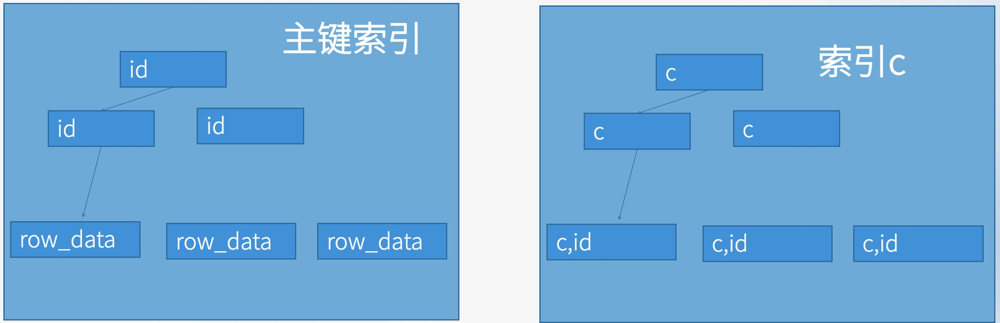

# 5. 怎么判断慢查询语句是否有优化空间

- 了解语句的执行流程
- 对比执行过程的消耗,与输出结果之间的差异空间,就是可以操作的空间

- 例:现有一表结构如下:

```SQL
CREATE TABLE `a` (
  `id` int NOT NULL,
  `c` int DEFAULT NULL,
  `d` int DEFAULT NULL,
  `e` text COLLATE utf8mb4_general_ci,
  PRIMARY KEY (`id`),
  KEY `c` (`c`)
) ENGINE=InnoDB DEFAULT CHARSET=utf8mb4 COLLATE=utf8mb4_general_ci;
```

向该表中插入了100条数据:

```
DELIMITER //

CREATE PROCEDURE batch_insert_a()
BEGIN
    DECLARE i INT DEFAULT 1;
    WHILE i <= 100 DO
        INSERT INTO a (id, c, d, e)
        VALUES (i, i, i, REPEAT('a', 16000));
        SET i = i + 1;
    END WHILE;
END//

DELIMITER ;

-- 调用
CALL batch_insert_a();
```

- 那么类似如下语句:

```SQL
SELECT * FROM `a`;
```

这种语句实际上就是没有优化空间的,唯一能想的办法就是要么放到分析库上去执行这种语句

- 比如这条语句:

```SQL
SELECT *
FROM `a`
WHERE `c` > 10
AND `c` < 20
AND `d` >= 15
```

- 问: 这条语句的`Rows_examined`值是多少?
- 答: 9
- 分析: 
	- 因为`c`是二级索引,所以查询中的`c > 10 AND c < 20`就能查到9个符合条件的主键
	- 然后回表9次(二级索引(非聚簇索引)的叶子节点只保存索引列和主键值,再通过主键值回表找到实际数据行)
	- 因此`Rows_examined`值为9(回表了才算,也就是回表读整行时,`Rows_examined`就+1)
	- 然后在Server层判断`d >= 15`,返回符合条件的数据,因此`Rows_sent`值为5



```
# Time: 2025-07-15T16:42:57.821590Z
# User@Host: root[root] @  [192.168.1.151]  Id:    10
# Query_time: 0.003772  Lock_time: 0.000007 Rows_sent: 5  Rows_examined: 9 Thread_id: 10 Errno: 0 Killed: 0 Bytes_received: 71 Bytes_sent: 442 Read_first: 0 Read_last: 0 Read_key: 1 Read_next: 9 Read_prev: 0 Read_rnd: 0 Read_rnd_next: 0 Sort_merge_passes: 0 Sort_range_count: 0 Sort_rows: 0 Sort_scan_count: 0 Created_tmp_disk_tables: 0 Created_tmp_tables: 0 Start: 2025-07-15T16:42:57.817818Z End: 2025-07-15T16:42:57.821590Z
SET timestamp=1752597777;
SELECT *
FROM `a`
WHERE `c` > 10
AND `c` < 20
AND `d` >= 15;
```

- 问: 如果这条SQL慢,是慢在哪里?(或者说这条SQL的优化空间在哪儿?)
- 答: 从引擎层到Server层读了9条数据,而实际上Server层返回给客户端的只有5条数据,中间不需要的那4条(不满足`d>=15`的4条)就是优化空间
- 优化思路: 由于`e`是一个很大的字段(16KB),所以多读出来的4条其实是比较大的,想办法不要让引擎层扫描到这4条,就可以实现优化
	- step1. 先查符合`where c>10 and c<20 and d>=15`的`id`
	- step2. 再根据符合条件的`id`查整行
- 这样就减少了引擎层到Server层的传输
	- 也就是说,所有引擎层传输给Server层的`e`字段(即16KB),都是最终结果所需要的,不会传输不被需要的`e`字段了

```SQL
SELECT *
FROM `a`
WHERE `id`
IN (
	SELECT `id`
	FROM `a`
	WHERE `c` > 10
	AND `c` < 20
	AND `d` >= 15
)
```

```
# Time: 2025-07-15T16:43:11.452318Z
# User@Host: root[root] @  [192.168.1.151]  Id:    10
# Query_time: 0.004001  Lock_time: 0.000008 Rows_sent: 5  Rows_examined: 14 Thread_id: 10 Errno: 0 Killed: 0 Bytes_received: 94 Bytes_sent: 442 Read_first: 0 Read_last: 0 Read_key: 6 Read_next: 9 Read_prev: 0 Read_rnd: 0 Read_rnd_next: 0 Sort_merge_passes: 0 Sort_range_count: 0 Sort_rows: 0 Sort_scan_count: 0 Created_tmp_disk_tables: 0 Created_tmp_tables: 0 Start: 2025-07-15T16:43:11.448317Z End: 2025-07-15T16:43:11.452318Z
SET timestamp=1752597791;
SELECT *
FROM `a`
WHERE `id`
IN (
	SELECT `id`
	FROM `a`
	WHERE `c` > 10
	AND `c` < 20
	AND `d` >= 15
);
```

- 注: 
	- 这里的`Rows_examined`值为14是因为子查询先扫描了9条,然后和最外层的查询进行JOIN的时候又扫描了5条,所以是14
	- 实际上这里的顺序是子查询查到`id = 15`,符合条件,则直接JOIN到`a`表,查询一行(读off-page),完成JOIN后,子查询再取扫描下一个符合条件的`id`

- 问: 在执行子查询(即`SELECT id FROM a WHERE c>10 AND c<20 AND d>=15`)时,innoDB在读取`row_data`时,是只读了`id`和`d`这2个字段从磁盘读出来,还是把整行数据磁盘读出来?
- 答: 读了整行数据.**因为innoDB是行存的,没有办法单独读某几列**

- 问: 那既然把`e`都读出来了,那这个优化还有意义吗?
- 答: 确实所有字段都读了,但是`e`这一列只读了几百个(768)字节,因为这么大的字段是没有办法存到主键索引中去的(innoDB的页只有16KB),在索引中针对这种大字段,只存了几百个字节和一个指针,指针指向磁盘中真实存储这个字段的地址(off-page存储机制)
- 也就是说,子查询的过滤条件,只用到了索引中存储的数据,只有在确定最终结果时(也就是最外层的查询),才会真的去读大字段;
- 而优化前的语句,是真的要去读9次大字段的